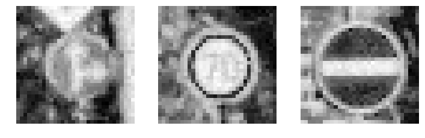
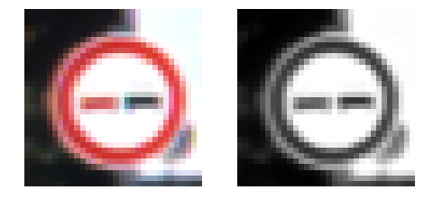
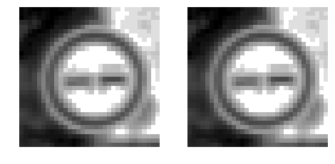
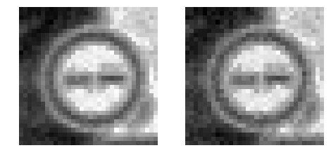

#**Traffic Sign Recognition** 

---

**Build a Traffic Sign Recognition Project**

## Introduction
This is homework at Self-driving car nanodegree from UDacity. This homework is done by Hengjiu Kang.

*Last three sections used some codes from [NikolasEnt](https://github.com/NikolasEnt/Traffic-Sign-Classifier/blob/master/Traffic_Sign_Classifier.ipynb) to show the images*

The goals / steps of this project are the following:
* Load the data set (see below for links to the project data set)
* Explore, summarize and visualize the data set
* Design, train and test a model architecture
* Use the model to make predictions on new images
* Analyze the softmax probabilities of the new images
* Summarize the results with a written report


[//]: # (Image References)

 "Random Noise"

## Rubric Points
###Here I will consider the [rubric points](https://review.udacity.com/#!/rubrics/481/view) individually and describe how I addressed each point in my implementation.  

#Data Set Summary & Exploration

## Input data
Input data are pictures(in pixels) in 32x32x3 dimensions. The original data has RGB channels, but in my training process, I just use grascale pictures.

```python
training_file = "train.p"
validation_file= "valid.p"
testing_file = "test.p"

with open(training_file, mode='rb') as f:
    train = pickle.load(f)
with open(validation_file, mode='rb') as f:
    valid = pickle.load(f)
with open(testing_file, mode='rb') as f:
    test = pickle.load(f)
    
X_train, y_train = train['features'], train['labels']
X_valid, y_valid = valid['features'], valid['labels']
X_test, y_test = test['features'], test['labels']
``` 
and the basic information is:
```
Number of training examples = 34799
Number of testing examples = 12630
Image data shape = (32, 32)
Number of classes = 43
```

## Pre-process
In this section, I built a 4-stage pipline processing the images. They are:
* Grayscale: 'shrink' RGB channels to one, simplifier the training data, and give it a better focus.

* EqualizeHist: Adjust the bright and dark region, make the picture more readable.

* Normalize: Conver the uint8 type to float point, make it possible to train the kernel.

* Gaussian noise: It is somehow very useful. After several tries, I found that adding gaussian noise is a good way to avoid overfit.


As the code below:
```python
def pre_process(image_data):
    result_set = []
    for i in range(len(image_data)):
        image = cv2.cvtColor(image_data[i], cv2.COLOR_BGR2GRAY)
        image = cv2.equalizeHist(image)
        image = cv2.normalize(image, image, alpha=0, beta=1, norm_type=cv2.NORM_MINMAX, dtype=cv2.CV_32F)
        image = noisy(image)
        result_set.append(np.expand_dims(image, axis=2))
    return result_set

```


#Design and Test a Model Architecture

At Step 3, I construct the net work, build the model and do the actual training work.
I modified the network based on LeNet-5. LeNet-5 is good at previous lab in recognizing the handwritten digits, but in traffic sign recognition, it only has about 5% correctness, which is considered as random choices.


My final model consisted of the following layers:

| Layer         		|     Description	        					| 
|:---------------------:|:---------------------------------------------:| 
| Input         		| 32x32x1 grayscale image   							| 
| Convolution 5x5     	| 1x1 stride, valid padding, outputs 28x28x64 	|
| RELU					|												|
| Max pooling	      	| 2x2 stride,  outputs 14x14x64 				|
| Convolution 5x5	    | 1x1 stride, valid padding, outputs 10x10x32     									|
| Sigmoid		|         									|
| Fully connected       | 800 input, 240 output                                         |
| Sigmoid				|        									|
|	Fully Connected				|	240 input, 43 output					|
|						|												| 

From step 3.2 to step 3.4, I extracted labels, setup training pipline and model evaluation process.


# Training process
At Step 3.5 I trained the model.

The code for calculating the accuracy of the model is located in the ninth cell of the Ipython notebook.

My final model results were:
* training set accuracy of 95.7%
* validation set accuracy of 93.2% 
* test set accuracy of 83.33% (6 pictures)

Following are my steps optimize the network:
* I start with LeNet-5, because it is the network that I am familiar with from the previous class. But eventually I found that this net only gave me around 5% correctness. Then I print out the loss during each iteration.
* I found that loss is constantly increasing, or "explosion" after several iterations. I thought that it was because of the overfit or completely lost of control. Recall that this network worked great during the hand digit recognition, this setup maybe too simple to recognize the traffic signs in relatively complex environment.
* So I increased the layers of the first convolution from 6 to 64, and changing the rest of layers accordingly.
* After this modification, the network immediately gave me around 80% correctness.
* Tuning parameters including batch size and epochs did not optimize result much, so I tried something else.
* I looked at the original pictures, found that original pictures were very "clean", meant that network may be overfit, because it may not recognize the signs in more general ways. So I added noise to the training set.
* After this step, it gave me about 88% correctness. 
* Looking at the loss data, I found that loss will float around some constant and will not decrease anymore, no matter I change the learning rate or epchs. After reading some papers, I found that fully connected layers can remember a lot of information, but it may avoid back propogation to the neurons, so I remove a fully connected layer. 
* After that modification, this network gave me about 94% correctness. I think it is good enough.


###Test a Model on New Images


Here are six German traffic signs that I found on the web:

![alt text][./1.jpg] ![alt text][./2.jpg] ![alt text][./3.jpg] 
![alt text][./4.jpg] ![alt text][./5.jpg] ![alt text][./6.jpg]

I think the last image maybe hard to recognize, because it is dark.

#### Prediction on the real signs

Here are the results of the prediction:

| Image			        |     Prediction	        					| 
|:---------------------:|:---------------------------------------------:| 
| Yield      		| Yield   									| 
| Speed limit 40km/h     			| Speed limit 50km/h										|
| Priority road					| Priority road 											|
| Go straight or left	      		| Go straight or left					 				|
| Ahead only			| Ahead only      							|
| Speed limit 20km/h            | Speed limit 20km/h                                |

The model was able to correctly guess 5 of the 6 traffic signs, which gives an accuracy of 83.33%. 

But I feel confuse about the 40km/h sign, because it is clear, easy to read, and according to the bar chart analyze at step 4.3
the network does not show any posibility on the 40km/h sign. It seems like the network does not know the 40km/h sign at all.
I will do more test in the future.